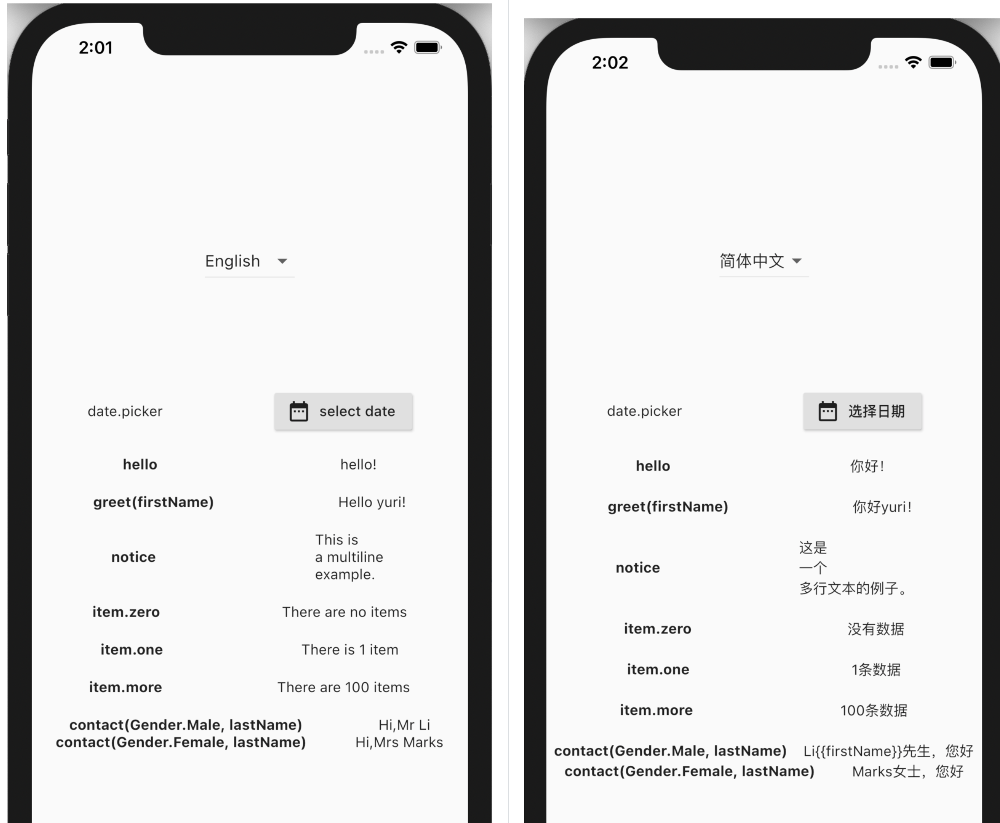
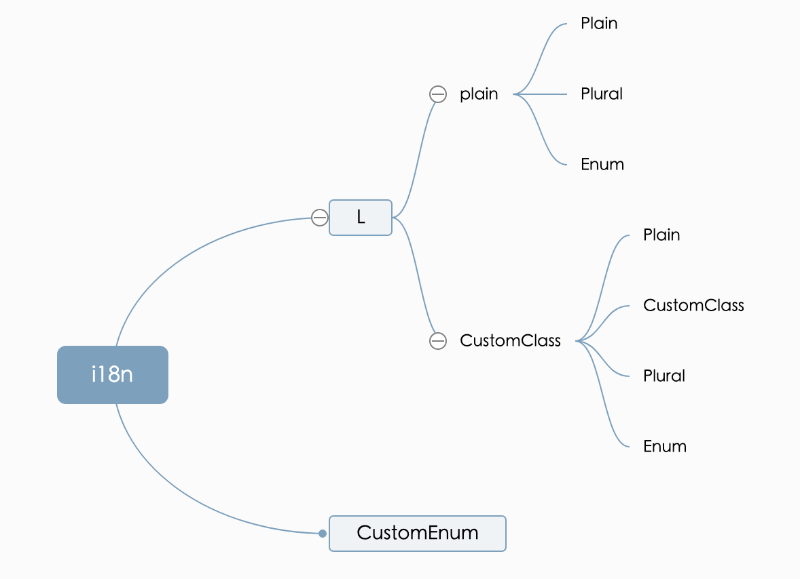

# GetX i18N

1. Use excel to configure internationalized messages
2. Parse into dart code that can be used by getx




# 1 demo

## 1.1 parse csv

```
import 'dart:io';

import 'model/Header.dart';
import 'model/Sheet.dart';
import 'service/CsvParser.dart';

Future<void> main() async {
  //1. params
  final locales = {
    'en_US': 'English',
    'zh_CN': '简体中文',
  };
  final from = 'bin/i18n.csv';
  final to = '/Users/yuri/workspace/idea/study/flutter_study/lib/config/lang.dart';

  //2. parser
  final sheet = Sheet(locales, await CsvParser(
    path: from,
    header: Header(langList: locales.keys.toList()),
  ).rowList());

  //3. write file
  final file = File(to);
  await file.writeAsString(sheet.toString());
}
```

## 1.2 csv template

| Key                              | (Comments)                                                   | en_US                           | zh_CN                               |
| -------------------------------- | ------------------------------------------------------------ | ------------------------------- | ----------------------------------- |
| hello                            | plain text                                                   | hello!                          | 你好！                              |
| notice                           | Usually used for announcement information, such as notifications when a new version of the app is released, special offers, etc. | This is   a multiline  example. | 这是   一个   多行文本的例子。      |
| greet                            | text with parameters                                         | Hello {{firstName}}!            | 你好{{firstName}}！                 |
| date.picker                      |                                                              | select date                     | 选择日期                            |
| product.online.item(Plural.Zero) | plural                                                       | There are no items              | 没有数据                            |
| product.online.item(Plural.One)  | There is 1 item                                              | {{count}}条数据                 |                                     |
| product.online.item(Plural.More) | There are {{count}} items                                    | {{count}}条数据                 |                                     |
| user.contact(Gender.Male)        | enumeration                                                  | Hi,Mr {{lastName}}              | {{lastName}}{{firstName}}先生，您好 |
| user.contact(Gender.Female)      | Hi,Mrs {{lastName}}                                          | {{lastName}}女士，您好          |                                     |
| product.instock                  |                                                              | surplus goods {{count}}         | 库存{{count}}                       |


## 1.3 generated dart code

```
import 'dart:ui';

import 'package:get/get.dart';

class L extends Translations {
  static final locales = {
    'en_US': 'English',
    'zh_CN': '简体中文',
  };
  static final defaultLocale = Locale('en', 'US');
  static final fallbackLocale = Locale('en', 'US');

  @override
  Map<String, Map<String, String>> get keys => {
        'en_US': {
          'hello': 'hello!',
          'notice': '''This is  
a multiline 
example.''',
          'greet': 'Hello {{firstName}}!',
          'date.picker': 'select date',
          'product.online.item.Zero': 'There are no items',
          'product.online.item.One': 'There is 1 item',
          'product.online.item.More': 'There are {{count}} items',
          'user.contact.Male': 'Hi,Mr {{lastName}}',
          'user.contact.Female': 'Hi,Mrs {{lastName}}',
          'product.instock': 'surplus goods {{count}}'
        },
        'zh_CN': {
          'hello': '你好！',
          'notice': '''这是  
一个  
多行文本的例子。''',
          'greet': '你好{{firstName}}！',
          'date.picker': '选择日期',
          'product.online.item.Zero': '没有数据',
          'product.online.item.One': '{{count}}条数据',
          'product.online.item.More': '{{count}}条数据',
          'user.contact.Male': '{{lastName}}{{firstName}}先生，您好',
          'user.contact.Female': '{{lastName}}女士，您好',
          'product.instock': '库存{{count}}'
        }
      };
  static String get hello => 'hello'.tr;
  static String get notice => 'notice'.tr;
  static String greet(
    String firstName,
  ) =>
      'greet'.trMap({
        'firstName': firstName,
      });
  static L_date get date => L_date();
  static L_user get user => L_user();
  static L_product get product => L_product();
}

class L_date {
  static final L_date _singleton = L_date._internal();
  factory L_date() {
    return _singleton;
  }
  L_date._internal();
  String get picker => 'date.picker'.tr;
}

class L_user {
  static final L_user _singleton = L_user._internal();
  factory L_user() {
    return _singleton;
  }
  L_user._internal();
  String contact(
    Gender gender,
    String lastName,
    String firstName,
  ) {
    if (gender == Gender.Male) {
      return 'user.contact.Male'.trMap({
        'gender': gender.toString(),
        'lastName': lastName,
        'firstName': firstName,
      });
    }
    if (gender == Gender.Female) {
      return 'user.contact.Female'.trMap({
        'gender': gender.toString(),
        'lastName': lastName,
        'firstName': firstName,
      });
    }
  }
}

class L_product {
  static final L_product _singleton = L_product._internal();
  factory L_product() {
    return _singleton;
  }
  L_product._internal();
  String instock(
    int count,
  ) =>
      'product.instock'.trMap({
        'count': count.toString(),
      });
  L_product_online get online => L_product_online();
}

class L_product_online {
  static final L_product_online _singleton = L_product_online._internal();
  factory L_product_online() {
    return _singleton;
  }
  L_product_online._internal();
  String item(
    int count,
  ) {
    if (count == 0) {
      return 'product.online.item.Zero'.trMap({
        'count': count.toString(),
      });
    } else if (count == 1) {
      return 'product.online.item.One'.trMap({
        'count': count.toString(),
      });
    } else {
      return 'product.online.item.More'.trMap({
        'count': count.toString(),
      });
    }
  }
}

enum Gender { Male, Female }

extension CustomTrans on String {
  String trMap(Map<String, String> map) {
    var text = tr;
    map.forEach((key, value) {
      if (value != null) {
        text = text.replaceAll('{{${key}}}', value);
      }
    });
    return text;
  }
}
```

## 1.4 flutter main.dart

```
void main() {
  runApp(GetMaterialApp(
    debugShowCheckedModeBanner: false,
    locale: L.defaultLocale,
    fallbackLocale: L.fallbackLocale,
    localizationsDelegates: [
      GlobalMaterialLocalizations.delegate,
      GlobalWidgetsLocalizations.delegate,
      GlobalCupertinoLocalizations.delegate,
    ],
    translations: L(),//generated getx Translations
    ...
  ));
}
```


## 1.5 lang_screen.dart

```
import 'package:flutter/material.dart';
import 'package:flutter_study/config/lang.dart';
import 'package:flutter_study/controller/LangController.dart';
import 'package:get/get.dart';

class LangScreen extends StatelessWidget {
  @override
  Widget build(BuildContext context) {
    final controller = Get.find<LangController>();

    return Scaffold(
      body: Center(
        child: Column(
          mainAxisAlignment: MainAxisAlignment.center,
          children: [
            DropdownButton<String>(
              icon: Icon(Icons.arrow_drop_down),
              value: controller.lang,
              items: L.locales.entries.map((entry) => DropdownMenuItem<String>(value: entry.key, child: Text(entry.value))).toList(),
              onChanged: (String value) {
                controller.changeLocale(value);
              },
            ),
            SizedBox(height: 100),
            Row(
              mainAxisAlignment: MainAxisAlignment.spaceAround,
              children: [
                Text('date.picker'),
                RaisedButton.icon(
                  icon: Icon(Icons.date_range),
                  label: Text(L.date.picker),
                  onPressed: () async {
                    await showDatePicker(
                      context: context,
                      locale: controller.lang.toLocale(),
                      initialDate: DateTime.now(),
                      firstDate: DateTime(2020),
                      lastDate: DateTime(2025),
                    );
                  },
                ),
              ],
            ),
            SizedBox(height: 20),
            Row(
                mainAxisAlignment: MainAxisAlignment.spaceAround,
                children: [
                  Text('hello', style: TextStyle(fontWeight: FontWeight.bold),),
                  Text(L.hello),
                ],
            ),
            SizedBox(height: 20),
            Row(
              mainAxisAlignment: MainAxisAlignment.spaceAround,
              children: [
                Text('greet(firstName)', style: TextStyle(fontWeight: FontWeight.bold),),
                Text(L.greet('yuri')),
              ],
            ),
            SizedBox(height: 20),
            Row(
              mainAxisAlignment: MainAxisAlignment.spaceAround,
              children: [
                Text('notice', style: TextStyle(fontWeight: FontWeight.bold),),
                Text(L.notice),
              ],
            ),
            SizedBox(height: 20),
            Row(
              mainAxisAlignment: MainAxisAlignment.spaceAround,
              children: [
                Text('item.zero', style: TextStyle(fontWeight: FontWeight.bold),),
                Text(L.product.online.item(0)),
              ],
            ),
            SizedBox(height: 20),
            Row(
              mainAxisAlignment: MainAxisAlignment.spaceAround,
              children: [
                Text('item.one', style: TextStyle(fontWeight: FontWeight.bold),),
                Text(L.product.online.item(1)),
              ],
            ),
            SizedBox(height: 20),
            Row(
              mainAxisAlignment: MainAxisAlignment.spaceAround,
              children: [
                Text('item.more', style: TextStyle(fontWeight: FontWeight.bold),),
                Text(L.product.online.item(100)),
              ],
            ),
            SizedBox(height: 20),
            Row(
              mainAxisAlignment: MainAxisAlignment.spaceAround,
              children: [
                Text('contact(Gender.Male, lastName)', style: TextStyle(fontWeight: FontWeight.bold),),
                Text(L.user.contact(Gender.Male, 'Li', null)),
              ],
            ),
            Row(
              mainAxisAlignment: MainAxisAlignment.spaceAround,
              children: [
                Text('contact(Gender.Female, lastName)', style: TextStyle(fontWeight: FontWeight.bold),),
                Text(L.user.contact(Gender.Female, 'Marks', null)),
              ],
            ),
          ],
        ),
      ),
    );
  }
}

```


# 2 template

Just completed the function of parsing csv, the code quality is not good. However, the model design is okay. See the source code for details



 

